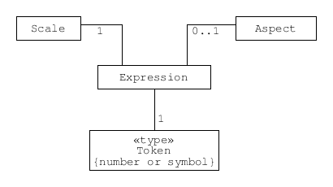

.. _concept_m_expressions: 

The M-layer expression of measurement data
==========================================

.. contents::
   :local:

The M-layer supports the unambiguous representation of measurement data in digital systems using *expressions*. 

In traditional unit systems, like the SI, a quantity is expressed using two factors: a value and a name or symbol for a unit (e.g., 10 kg). 
The M-layer uses three components to express a datum: a token, a scale, and an aspect. 
This allows the M-layer to represent a wider range of measurement data than traditional unit systems. These three components are generalisations of concepts from traditional unit systems. 

   
   A UML class diagram showing an expression with a token (value), 
   scale and aspect (kind of quantity). An aspect is not necessarily 
   part of an expression, but it is needed 
   to resolve some cases of ambiguity.
   

Tokens
------

A token corresponds to the numeric factor in a traditional expression. A token will usually be numeric, but some measurement data adopt symbols other than numbers to denote a result, so the M-layer accommodates this possibility.

.. _concept_m_expressions_scales:

Scales
------
  

Traditional units do not convey information about the structure of data values. However, the M-layer uses entities called scales to associate a unit (or other reference) with information about the structure of data values. This can be used to manage changes of expression (conversion or casting) and is sometimes helpful in distinguishing between closely related expressions. For example, a ratio scale associated with the unit degree Celsius is distinct from an interval scale associated with the same unit (the former could be for expression of a temperature difference whereas the latter would be used to express absolute temperature). 

The M-layer includes 5 scale types. For each, there is a characteristic form of transformation that generates a different scale of the same type (an invariance transform). For example, multiplying values on a ratio scale by a positive real number produces another ratio scale.

.. list-table:: Scale types and invariance transforms. Note, here the 'mod' operator divides the left argument by the right and returns the remainder with the same sign as the right argument.
   :width: 75%
   :widths: 15 30
   :header-rows: 1

   * - Type
     - Invariance transforms
   * - ratio
     - :math:`x^\prime = a\, x ,\; a > 0`
   * - interval
     - :math:`x^\prime = a\, x + b ,\; a > 0`
   * - bounded-interval
     - :math:`x^\prime = (a\, x - x^\prime_\mathrm{low}) \;\text{mod}\; x^\prime_\mathrm{range} + x^\prime_\mathrm{low},\; a > 0`
   * - ordinal
     - any monotonic increasing function of :math:`x`
   * - nominal
     - any 1-to1 substitution for :math:`x`

Aspects
-------

Traditional unit systems assume that the kind of quantity can be inferred from contextual information. However, this poses a problem for digital systems. The M-layer uses the component called aspect to represent the kind of quantity in an expression. This can be used to discern legitimate conversion and casting operations for expressions.

Aspects may also be things that are not considered physical quantities (such as the intelligence of students, or the hardness of a material). 
