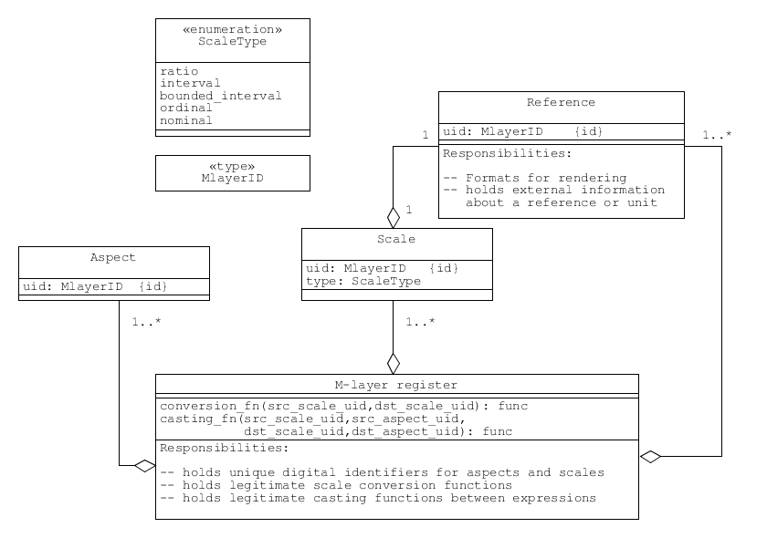

.. _concept_m_register: 

The M-layer register of scales and aspects
==========================================

.. contents::
   :local:

The M-layer uses compact digital objects to identify scales and aspects.
Each aspect, scale, and reference has a unique identifier, which can be used to access more detailed information in a central register. 

The register holds records of aspects, scales, and references (units or other types of reference),
and provides support for conversions and casting of expressions to different scales and aspects.
 

   
   A UML class diagram showing the central register and its associations. The register supports 
   scale conversion and casting from one expression to another by
   maintaining tables of legitimate conversions and casts, which are indexed by the unique 
   scale and aspect identifiers.   

Relationship between scales and references
------------------------------------------
In the M-layer, a 'reference' is a digital record for a unit of measure, or other 
measurement reference (e.g., a certified reference material). The record holds information
like formats for rendering and related external links. 

An M-layer 'scale' forms an association between a reference and a particular scale type (see :ref:`concept_m_expressions_scales`).

Expression conversion
---------------------
An expression can be converted from one scale to another if the operation to do so has been registered.

Scale conversion is similar to conversion in traditional unit systems.
However, the M-layer distinguishes between: 

    1) legitimate conversions for any aspect; and 
    2) conversions that are only legitimate for a particular aspect. 
    
An example of the first is conversion from metres to millimetres.
An example of the second is the conversion of an expression of photon energy in electronvolts to terahertz. 

Expression casting 
------------------

Expression casting can change the aspect as well as the type of scale for an expression. The distinction between conversion and casting is made so that operations which could substantially alter the data are separated from those that simply apply an invariance transformation. For instance, a cast is required to change an expression of photon energy from terahertz to nanometres, because wavelength is inversely related to frequency (i.e., there is a change of variable from frequency to wavelength). 

 